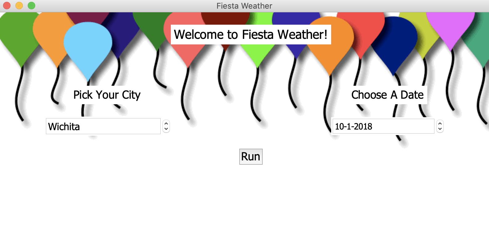

# Weather-Application
This weather application was for a Data Structures (CS 400) project. The project was to learn a brand-new language, so I chose Python (3.6).
The application involved gathering data from a website -- specifically, the weather of the selected cities and dates.
Once the data was gathered it was stored in a SQL database. 
Then, a GUI was created to query the database and display the information accordingly.

